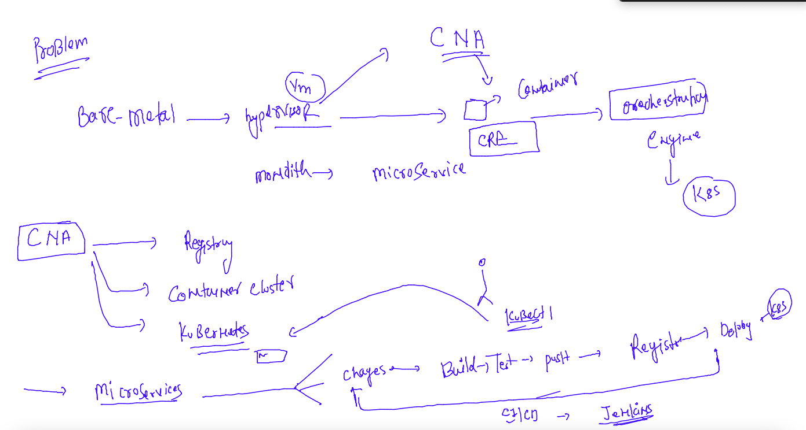
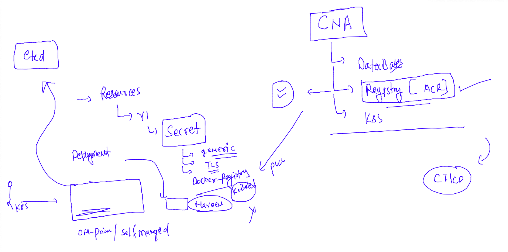
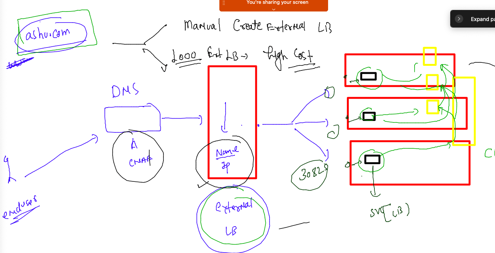
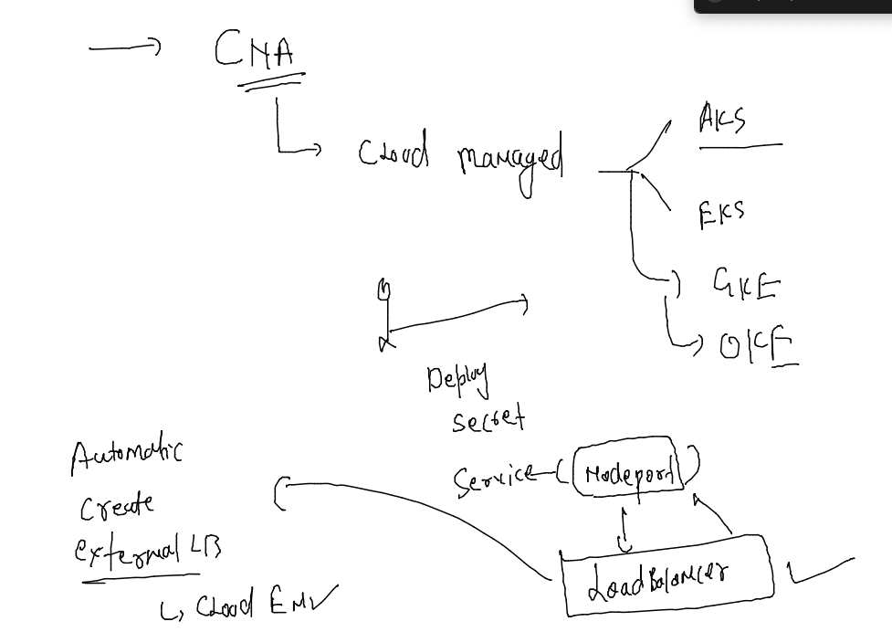
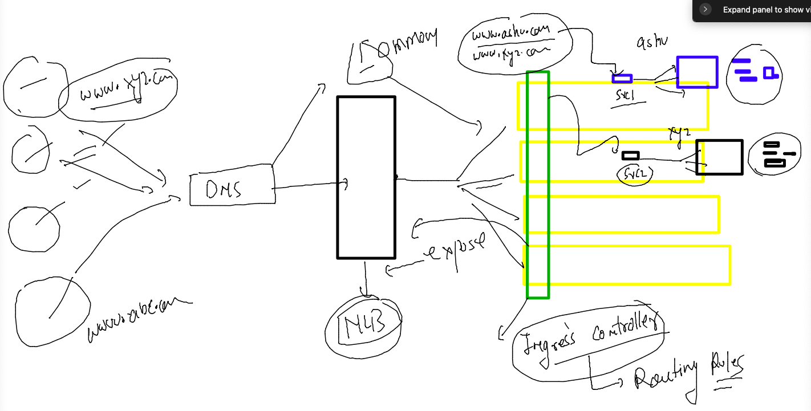

# CNA --

### training plan 


### revision 



### namespace resources cleanup 

```
[ashu@docker-server ~]$ kubectl  get  all
No resources found in ashu-apps namespace.
[ashu@docker-server ~]$ 
[ashu@docker-server ~]$ kubectl  delete all --all
No resources found
[ashu@docker-server ~]$ 


```

### create deployment 

```
kubectl create  deployment  ashuapp  --image=ciscoapps.azurecr.io/commonrepo:ashuappv1.0         --port 80 --dry-run=client  -o yaml  >azureapp_deploy.yaml 
```

###

```
[ashu@docker-server acr_deployment]$ vim azureapp_deploy.yaml 
[ashu@docker-server acr_deployment]$ kubectl apply -f  azureapp_deploy.yaml 
deployment.apps/ashuapp created
[ashu@docker-server acr_deployment]$ kubectl  get deploy 
NAME      READY   UP-TO-DATE   AVAILABLE   AGE
ashuapp   0/1     1            0           4s
[ashu@docker-server acr_deployment]$ kubectl  get  po 
NAME                       READY   STATUS         RESTARTS   AGE
ashuapp-7965b7b77d-hfz5j   0/1     ErrImagePull   0          14s
[ashu@docker-server acr_deployment]$ kubectl  get  po 
NAME                       READY   STATUS             RESTARTS   AGE
ashuapp-7965b7b77d-hfz5j   0/1     ImagePullBackOff   0          58s
```

### private registry image need secret to store cred in k8s etcd 



### creating 

```
[ashu@docker-server acr_deployment]$ kubectl   create  secret  
Create a secret using specified subcommand.

Available Commands:
  docker-registry   Create a secret for use with a Docker registry
  generic           Create a secret from a local file, directory, or literal value
  tls               Create a TLS secret


 kubectl   create  secret  docker-registry  ashu-azure-secret --docker-server=ciscoapps.azurecr.io  --docker-username="ciscoapps"  --docker-password="YizGgU/aL "  --dry-run=client -o yaml >secret.yaml
 
  710  kubectl  apply -f  secret.yaml 
  711  kubectl  get  secret 
  712  ls
  713  history 
[ashu@docker-server acr_deployment]$ kubectl  get  secret
NAME                TYPE                             DATA   AGE
ashu-azure-secret   kubernetes.io/dockerconfigjson   1      94s
```

### final yaml 

```
[ashu@docker-server acr_deployment]$ cat azureapp_deploy.yaml 
apiVersion: apps/v1
kind: Deployment
metadata:
  creationTimestamp: null
  labels:
    app: ashuapp
  name: ashuapp
spec:
  replicas: 1
  selector:
    matchLabels:
      app: ashuapp
  strategy: {}
  template:
    metadata:
      creationTimestamp: null
      labels:
        app: ashuapp
    spec:
      imagePullSecrets: # calling secret for image pull purpose 
      - name: ashu-azure-secret # name of secret 
      containers:
      - image: ciscoapps.azurecr.io/commonrepo:ashuappv1.0
        name: commonrepo
        ports:
        - containerPort: 80
        resources: {}
status: {}

```

### redeploy 

```
[ashu@docker-server acr_deployment]$ kubectl apply -f azureapp_deploy.yaml 
deployment.apps/ashuapp configured
[ashu@docker-server acr_deployment]$ kubectl  get  deploy 
NAME      READY   UP-TO-DATE   AVAILABLE   AGE
ashuapp   1/1     1            1           17m
[ashu@docker-server acr_deployment]$ kubectl  get  po
NAME                       READY   STATUS    RESTARTS   AGE
ashuapp-85dbcdd8c6-947hk   1/1     Running   0          12s
[ashu@docker-server acr_deployment]$ kubectl  get  po -owide
NAME                       READY   STATUS    RESTARTS   AGE   IP               NODE          NOMINATED NODE   READINESS GATES
ashuapp-85dbcdd8c6-947hk   1/1     Running   0          18s   192.168.162.31   siva-worker   <none>           <none>
[ashu@docker-server acr_deployment]$ kubectl  get secret 
NAME                TYPE                             DATA   AGE
ashu-azure-secret   kubernetes.io/dockerconfigjson   1      7m21s
[ashu@docker-server acr_deployment]$ 


```

### exposing all using service 

```
[ashu@docker-server acr_deployment]$ kubectl  get  deploy 
NAME      READY   UP-TO-DATE   AVAILABLE   AGE
ashuapp   1/1     1            1           19m
[ashu@docker-server acr_deployment]$ kubectl  expose deploy  ashuapp  --type NodePort --port 80 --name ashulb1  --dry-run=client -o   yaml  >azuresvc.yaml 
[ashu@docker-server acr_deployment]$ ls
azureapp_deploy.yaml  azuresvc.yaml  secret.yaml
[ashu@docker-server acr_deployment]$ kubectl  apply -f  azuresvc.yaml 
service/ashulb1 created
[ashu@docker-server acr_deployment]$ kubectl  get  svc
NAME      TYPE       CLUSTER-IP      EXTERNAL-IP   PORT(S)        AGE
ashulb1   NodePort   10.103.68.243   <none>        80:30825/TCP   4s
[ashu@docker-server acr_deployment]$ 

```

### load balancer related problems 



### Cloud managed k8s solution 



### Ingress controller as solution 



### for Cd purpose we deploying argoCD 

```
 771  kubectl create namespace argocd
  772  kubectl apply -n argocd -f https://raw.githubusercontent.com/argoproj/argo-cd/stable/manifests/install.yaml
```


