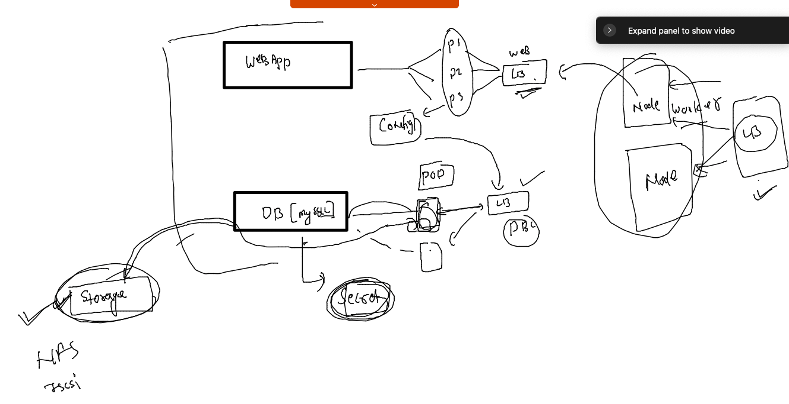

# CNA --

### training plan 


### cleaning namespace

```
[ashu@docker-server ~]$ kubectl delete all --all
pod "ashufrontend-66ccfb99c-25g2r" deleted
pod "ashufrontend-66ccfb99c-9pfkl" deleted
pod "ashufrontend-66ccfb99c-jr4sk" deleted
pod "mydep1-5994b4566d-vxrqq" deleted
pod "net-test" deleted
service "ashufrontend-lb" deleted
deployment.apps "ashufrontend" deleted
deployment.apps "mydep1" deleted
[ashu@docker-server ~]$ 
[ashu@docker-server ~]$ kubectl  get  deploy 
No resources found in ashu-apps namespace.
[ashu@docker-server ~]$ kubectl  get po
No resources found in ashu-apps namespace.
[ashu@docker-server ~]$ kubectl  get svc
No resources found in ashu-apps namespace.
[ashu@docker-server ~]$ 
```

### lets Design  app and deploy in k8s



### Your storage will be planning remote storage you 

### demo NFS 

```

```

## webapp Deploy of -- Db 

### creating Deployment 

```
kubectl   create  deployment  ashudb  --image=mysql:5.6  --port 3306 --dry-run=client  -o yaml >db_deploy.yaml
```

### COnfiguration Details 

```
create  configmap  db-details  --from-literal MYSQL_USER="admin" --from-literal MYSQL_DATABASE="webapp"  --dry-run=client -o yaml  >db_configmap.yaml
```

### storing db credentials 

```
kubectl  create  secret generic  db-cred  --from-literal  sqlpass="Cisco@123#" --from-literal rootpass="Cisco@123#" --dry-run=client -o yaml  >db_secret.yaml
```

### Deployment file final 

```
[ashu@docker-server myapp]$ cat  db_deploy.yaml 
apiVersion: apps/v1
kind: Deployment
metadata:
  creationTimestamp: null
  labels:
    app: ashudb
  name: ashudb
spec:
  replicas: 1
  selector:
    matchLabels:
      app: ashudb
  strategy: {}
  template: # template section 
    metadata:
      creationTimestamp: null
      labels:
        app: ashudb
    spec:
      volumes: # to create volume from some source 
      - name: ashudb-vol
        hostPath:
         path: /db/ashu/ 
         type: DirectoryOrCreate
      containers:
      - image: mysql:5.6
        name: mysql
        ports:
        - containerPort: 3306
        volumeMounts: # to attach volume to the container 
        - name: ashudb-vol
          mountPath: /var/lib/mysql/ # defautl location where you store db 
        envFrom: # call from config details 
        - configMapRef:
            name: db-details 
        env: # call/ change env variable 
        - name: MYSQL_PASSWORD
          valueFrom: # reading value from some reference 
            secretKeyRef: # secret is the reference 
              name: db-cred 
              key: sqlpass
        - name: MYSQL_ROOT_PASSWORD
          valueFrom: # reading value from some reference 
            secretKeyRef: # secret is the reference 
              name: db-cred 
              key: rootpass
        resources: {}
status: {}

```

### final deploy of db section 

```
[ashu@docker-server myapp]$ kubectl replace -f . --force 
configmap "db-details" deleted
deployment.apps "ashudb" deleted
secret "db-cred" deleted
configmap/db-details replaced
deployment.apps/ashudb replaced
secret/db-cred replaced
[ashu@docker-server myapp]$ kubectl  get  deploy 
NAME     READY   UP-TO-DATE   AVAILABLE   AGE
ashudb   1/1     1            1           9s
[ashu@docker-server myapp]$ kubectl  get  cm
NAME               DATA   AGE
db-details         2      14s
kube-root-ca.crt   1      20h
[ashu@docker-server myapp]$ kubectl  get secret
NAME      TYPE     DATA   AGE
db-cred   Opaque   2      17s

```

### creating Internal LB for Db 

```
[ashu@docker-server ~]$ kubectl  get  deploy 
NAME     READY   UP-TO-DATE   AVAILABLE   AGE
ashudb   1/1     1            1           38m
[ashu@docker-server ~]$ kubectl expose deployment ashudb  --type ClusterIP --port 3306  --name ashudb-lb --dry-run=client -o yaml   >dbsvc.yaml

[ashu@docker-server myapp]$ kubectl apply -f  dbsvc.yaml 
service/ashudb-lb created
[ashu@docker-server myapp]$ kubectl  get  svc
NAME        TYPE        CLUSTER-IP     EXTERNAL-IP   PORT(S)    AGE
ashudb-lb   ClusterIP   10.99.132.76   <none>        3306/TCP   3s
[ashu@docker-server myapp]$ 


```

## webapp Deployment steps 

### deloyment file 

```
kubectl create  deployment  frontend  --image=wordpress:4.8-apache --port 80 --dry-run=client -o yaml    >web_deploy.yaml 
```

### db connect details 

```
 kubectl  create configmap  web-db-conn --from-literal  WORDPRESS_DB_USER="admin" --from-literal  WORDPRESS_DB_NAME="webapp" --from-literal WORDPRESS_DB_HOST="ashudb-lb"   --dry-run=client -o yaml >web_config.yaml
```

### calling configMap and secret in Deployment file 

```
[ashu@docker-server myapp]$ cat web_deploy.yaml 
apiVersion: apps/v1
kind: Deployment
metadata:
  creationTimestamp: null
  labels:
    app: frontend
  name: frontend
spec:
  replicas: 1
  selector:
    matchLabels:
      app: frontend
  strategy: {}
  template:
    metadata:
      creationTimestamp: null
      labels:
        app: frontend
    spec:
      containers:
      - image: wordpress:4.8-apache
        name: wordpress
        ports:
        - containerPort: 80
        envFrom: # calling configmap 
        - configMapRef:
           name: web-db-conn 
        env: # calling secret 
        - name: WORDPRESS_DB_PASSWORD
          valueFrom:
            secretKeyRef:
              name: db-cred
              key: sqlpass 
        resources: {}
status: {}

```


### lets deploy it 

```
ashu@docker-server myapp]$ kubectl apply -f  web_config.yaml  -f web_deploy.yaml 
configmap/web-db-conn created
deployment.apps/frontend created
[ashu@docker-server myapp]$ 
[ashu@docker-server myapp]$ kubectl  get  cm 
NAME               DATA   AGE
db-details         2      57m
kube-root-ca.crt   1      21h
web-db-conn        3      5s
[ashu@docker-server myapp]$ kubectl  get  deploy 
NAME       READY   UP-TO-DATE   AVAILABLE   AGE
ashudb     1/1     1            1           57m
frontend   0/1     1            0           9s
[ashu@docker-server myapp]$ kubectl  get  po
NAME                        READY   STATUS    RESTARTS   AGE
ashudb-6d845d6ff9-xgc2g     1/1     Running   0          57m
frontend-769f59c8d8-stn5v   1/1     Running   0          14s
[ashu@docker-server myapp]$ kubectl  get  deploy 
NAME       READY   UP-TO-DATE   AVAILABLE   AGE
ashudb     1/1     1            1           57m
frontend   1/1     1            1           17s
[ashu@docker-server myapp]$ 
```

### LB for front end 

```
[ashu@docker-server k8s-deployments]$ kubectl  get deploy 
NAME       READY   UP-TO-DATE   AVAILABLE   AGE
ashudb     1/1     1            1           80m
frontend   1/1     1            1           20m
[ashu@docker-server k8s-deployments]$ kubectl expose deploy frontend  --type NodePort  --port 80 --name frontlb 
service/frontlb exposed
[ashu@docker-server k8s-deployments]$ kubectl  get svc
NAME        TYPE        CLUSTER-IP       EXTERNAL-IP   PORT(S)        AGE
ashudb-lb   ClusterIP   10.99.132.76     <none>        3306/TCP       40m
frontlb     NodePort    10.108.128.218   <none>        80:31458/TCP   8s
[ashu@docker-server k8s-deployments]$ 


```

### history of commands 

```
 521  kubectl replace -f . --force 
  522  kubectl  get  cm 
  523  kubectl  get  secret
  524  kubectl  get deloy 
  525  kubectl  get deploy 
  526  kubectl  get po 
  527  kubectl logs  ashudb-fbf675fb8-qs9nr
  528  ls
  529  history 
  530  kubectl  create  secret generic  db_cred  --from-literal  sqlpass="Cisco@123#" --from-liter rootpass="Cisco@123#" --dry-run=client -o yaml  db_cred.yaml 
  531  kubectl  create  secret generic  db_cred  --from-literal  sqlpass="Cisco@123#" --from-literal rootpass="Cisco@123#" --dry-run=client -o yaml  db_cred.yaml 
  532  history 
  533  kubectl  create  secret generic  db_cred  --from-literal  sqlpass="Cisco@123#" --from-literal rootpass="Cisco@123#" --dry-run=client -o yaml  db_cred.yaml 
  534  kubectl  create  secret generic  db_cred  --from-literal  sqlpass="Cisco@123#" --from-literal rootpass="Cisco@123#" --dry-run=client -o yaml  >db_cred.yaml 
  535  history 
  536  ls
  537  vim db_deploy.yaml 
  538  kubectl replace -f . --force 
  539  vim db_secret.yaml 
  540  ls
  541  rm db_cred.yaml 
  542  vim db_secret.yaml 
  543  history 
  544  kubectl  create  secret generic  db_cred  --from-literal  sqlpass="Cisco@123#" --from-literal rootpass="Cisco@123#" --dry-run=client -o yaml  >db_secret.yaml 
  545  vim db_secret.yaml 
  546  history 
  547  kubectl replace -f . --force 
  548  kubectl  get  deploy 
  549  kubectl  get  cm
  550  kubectl  get secret
  551  cat  db_deploy.yaml 
  552  exit
  553  eixt
  554  exit
  555  kubectl  get  deploy 
  556  kubectl  get  cm
  557  kubectl  get secret
  558  kubectl  get  po
  559  exit
  560  ls
  561  cd ashu_apps/
  562  ls
  563  cd k8s-deployments/
  564  ls
  565  kubectl  get  deploy 
  566  kubectl  get svc
  567  kubectl get  po 
  568  kubectl exec -it  ashudb-6d845d6ff9-xgc2g -- bash 
  569  ls
  570  kubectl  get deploy 
  571  kubectl expose deploy frontend  --type NodePort  --port 80 --name frontlb 
  572  kubectl  get svc
  573  kubectl  get  no


```


