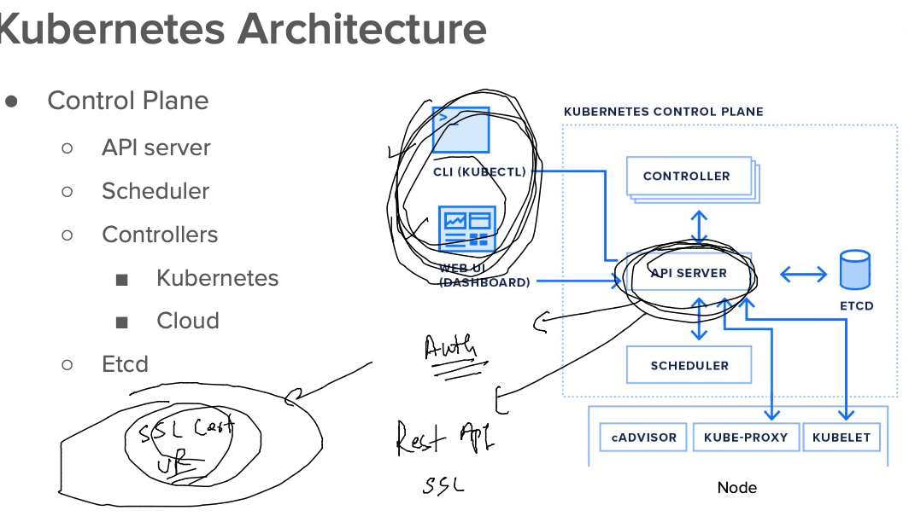
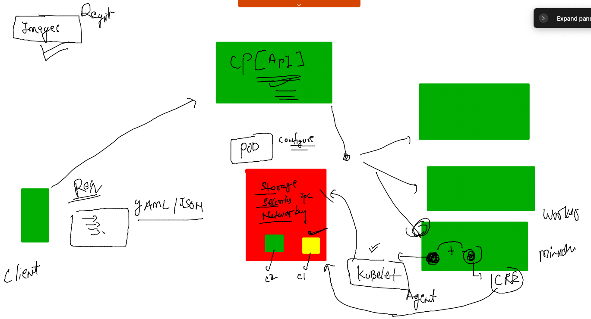

# CNA --

### training plan 


### pushing image to docker hub 

```
[ashu@docker-server ashu_apps]$ docker images  |   grep -i ashu
ciscoapps.azurecr.io/commonrepo    ashuappv1.0          e182a92e8d07   19 hours ago   448MB
ashufrontend                       appv1                e182a92e8d07   19 hours ago   448MB
[ashu@docker-server ashu_apps]$ 
[ashu@docker-server ashu_apps]$ 
[ashu@docker-server ashu_apps]$ docker  tag   ashufrontend:appv1  docker.io/dockerashu/ashufrontend:appv1  
[ashu@docker-server ashu_apps]$ 
[ashu@docker-server ashu_apps]$ docker login 
Login with your Docker ID to push and pull images from Docker Hub. If you don't have a Docker ID, head over to https://hub.docker.com to create one.
Username: dockerashu
Password: 
WARNING! Your password will be stored unencrypted in /home/ashu/.docker/config.json.
Configure a credential helper to remove this warning. See
https://docs.docker.com/engine/reference/commandline/login/#credentials-store

Login Succeeded
[ashu@docker-server ashu_apps]$ docker push  docker.io/dockerashu/ashufrontend:appv1
The push refers to repository [docker.io/dockerashu/ashufrontend]
4da3b6f39114: Pushed 
cc1d626a35c4: Pushing [========================>             

[ashu@docker-server ashu_apps]$ docker logout 
Removing login credentials for https://index.docker.io/v1/
```

### k8s cluster setup on prim 


## common steps in ALL the VMs

```
[root@ip-172-31-28-99 ~]# 
[root@ip-172-31-28-99 ~]# hostnamectl set-hostname   control-plane 
[root@ip-172-31-28-99 ~]# logout
[ec2-user@ip-172-31-28-99 ~]$ sudo -i
[root@control-plane ~]# hostname
control-plane
[root@control-plane ~]# 


=======>>ENABLE iptables modules 

[root@control-plane ~]# modprobe br_netfilter 
[root@control-plane ~]# echo '1' > /proc/sys/net/bridge/bridge-nf-call-iptables
[root@control-plane ~]# 

==========> Install any CRE 

root@control-plane ~]# yum install docker  -y  
Failed to set locale, defaulting to C
Loaded plugins: extras_suggestions, langpacks, priorities, update-motd
amzn2-core                                                                                                  | 3.7 kB  00:00:00     
Resolving Dependencies
--> Running transaction check
---> Package docker.x86_64 0:20.10.13-2.amzn2 will be installed
--> Processing Dependency: runc >= 1.0.0 for package: docker-20.10.13-2.amzn2.x86_64
--> Processing Dependency: libcgroup >= 0.40.rc1-5.15 for package: docker-20.10.13-2.amzn2.x86_64
--> Processing Dependency: containerd >= 1.3.2 for package: docker-20.10.13-2.amzn2.x86_64
--> Processing Dependency: pigz for package: docker-20.10.13-2.amzn2.x86_64
--> Running transaction check

======<<>> If you are using k8s 1.20 + version then only 

[root@control-plane ~]# cat  <<X  >/etc/docker/daemon.json
> {
>   "exec-opts": ["native.cgroupdriver=systemd"]
> }
> 
> X


[root@control-plane ~]# 
[root@control-plane ~]# systemctl daemon-reload 
[root@control-plane ~]# systemctl enable --now docker  # in any version you have to perform 
Created symlink from /etc/systemd/system/multi-user.target.wants/docker.service to /usr/lib/systemd/system/docker.service.
[root@control-plane ~]# 


============> Installing k8s installer tool called Kubeadm -- >?

cat  <<EOF  >/etc/yum.repos.d/kube.repo
> [kube]
> baseurl=https://packages.cloud.google.com/yum/repos/kubernetes-el7-x86_64
> gpgcheck=0
> EOF


==
yum  install  kubeadm -y  ; systemctl enable --now  kubelet

```

## ONly we need to perform on the system we want to configure as COntrol-plane 


```
root@control-plane ~]# kubeadm  init --pod-network-cidr=192.168.0.0/16  --apiserver-advertise-address=0.0.0.0   --apiserver-cert-extra-sans=3.12.189.181  
[init] Using Kubernetes version: v1.24.3
[preflight] Running pre-flight checks
	[WARNING FileExisting-tc]: tc not found in system path
	[WARNING Hostname]: hostname "control-plane" could not be reached
	[WARNING Hostname]: hostname "control-plane": lookup control-plane on 172.31.0.2:53: no such host
[preflight] Pulling images required for setting up a Kubernetes cluster
[preflight] This might take a minute or two, depending on the speed of your internet connection
[preflight] You can also perform this action in beforehand using 'kubeadm config images pull'
[certs] Using certificateDir folder "/etc/kubernetes/pki"
[certs] Generating "ca" certificate and key

```

### 

```
[root@control-plane ~]# mkdir -p $HOME/.kube
[root@control-plane ~]# cp -i /etc/kubernetes/admin.conf $HOME/.kube/config
```

### ONly ON worker Nodes 

```
kubeadm join 172.31.28.99:6443 --token v16x783hv9  --discovery-token-ca-cert-hash sha512:e629457bd08fe9646e
```

### check on control plane side only 

```
root@control-plane ~]# kubectl get  nodes
NAME               STATUS     ROLES           AGE    VERSION
control-plane      NotReady   control-plane   7m5s   v1.24.3
ezong-workernode   NotReady   <none>          51s    v1.24.3
ish-workernode     NotReady   <none>          61s    v1.24.3
naveehost          NotReady   <none>          54s    v1.24.3
rahul-woker-node   NotReady   <none>          53s    v1.24.3
siva-worker        NotReady 
```

### now implement Network CNI for container 

```
  21  wget https://docs.projectcalico.org/manifests/calico.yaml
   22  kubectl apply -f calico.yaml 
  
  ==
  [root@control-plane ~]# kubectl get  nodes
NAME               STATUS   ROLES           AGE     VERSION
control-plane      Ready    control-plane   10m     v1.24.3
ezong-workernode   Ready    <none>          4m11s   v1.24.3
inder-worker       Ready    <none>          3m19s   v1.24.3
ish-workernode     Ready    <none>          4m21s   v1.24.3
naveehost          Ready    <none>          4m14s   v1.24.3
prraina-wrkr       Ready    <none>          94s     v1.24.3
rahul-woker-node   Ready    <none>          4m13s   v1.24.3
siva-worker        Ready    <none>          4m31s   v1.24.3
ujjawal-worker     Ready    <none>       


```

### Install kubectl tool to connect k8s control plane on client side 

[LInk](https://kubernetes.io/docs/tasks/tools/)

### Now client / devops/ admin side operation to deploy app 

```
[ashu@docker-server ~]$ kubectl version --client -o yaml 
clientVersion:
  buildDate: "2022-07-13T14:30:46Z"
  compiler: gc
  gitCommit: aef86a93758dc3cb2c658dd9657ab4ad4afc21cb
  gitTreeState: clean
  gitVersion: v1.24.3
  goVersion: go1.18.3
  major: "1"
  minor: "24"
  platform: linux/amd64
kustomizeVersion: v4.5.4


```

### lets get auth details from control plane 



### on control plane location of auth file 

```
root@control-plane ~]# cd  /etc/kubernetes/
[root@control-plane kubernetes]# ls
admin.conf  controller-manager.conf  kubelet.conf  manifests  pki  scheduler.conf
[root@control-plane kubernetes]# more  admin.conf 
apiVersion: v1
clusters:
- cluster:
```

### client side setup 

```
[ashu@docker-server ~]$ whoami
ashu
[ashu@docker-server ~]$ pwd
/home/ashu
[ashu@docker-server ~]$ mkdir .kube 
[ashu@docker-server ~]$ cd .kube/
[ashu@docker-server .kube]$ wget  172.31.28.99/admin.conf 
--2022-07-20 06:35:52--  http://172.31.28.99/admin.conf
Connecting to 172.31.28.99:80... connected.
HTTP request sent, awaiting response... 200 OK
Length: 5636 (5.5K) [text/plain]
Saving to: ‘admin.conf’

100%[=============================================================================>] 5,636       --.-K/s   in 0s      

2022-07-20 06:35:52 (924 MB/s) - ‘admin.conf’ saved [5636/5636]

[ashu@docker-server .kube]$ ls
admin.conf
[ashu@docker-server .kube]$ mv admin.conf  config 
[ashu@docker-server .kube]$ 


```

### lets verify 

```
ashu@docker-server ~]$ kubectl  get  nodes
NAME               STATUS   ROLES           AGE   VERSION
arun-node          Ready    <none>          41m   v1.24.3
control-plane      Ready    control-plane   52m   v1.24.3
ezong-workernode   Ready    <none>          46m   v1.24.3
inder-worker       Ready    <none>          45m   v1.24.3
ish-workernode     Ready    <none>          46m   v1.24.3
naveehost          Ready    <none>          46m   v1.24.3
```

### Introduction to PODs 



### a basic k8s app request structure 

```
[ashu@docker-server k8s-deployments]$ vim   k8s-req-structure.yaml 
[ashu@docker-server k8s-deployments]$ cat  k8s-req-structure.yaml 
apiVersion:
kind: 
metadata:
spec: 
[ashu@docker-server k8s-deployments]$ vim   k8s-req-structure.yaml 
[ashu@docker-server k8s-deployments]$ cat k8s-req-structure.yaml 
apiVersion: v1
kind: Pod
metadata:
  name: ashupod-1
spec: 
  containers: 
```

### lets auto generate YAML 

```
[ashu@docker-server k8s-deployments]$ kubectl   run  ashuapp1  --image=docker.io/dockerashu/ashufrontend:appv1  --port 80  --dry-run=client  -o yaml 
apiVersion: v1
kind: Pod
metadata:
  creationTimestamp: null
  labels:
    run: ashuapp1
  name: ashuapp1
spec:

```

### store output in a yAML file 

```
kubectl   run  ashuapp1  --image=docker.io/dockerashu/ashufrontend:appv1  --port 80  --dry-run=client  -o yaml  >ashupod1.yaml
```

### lets deploy it 

```
[ashu@docker-server k8s-deployments]$ kubectl apply -f  ashupod1.yaml 
pod/ashuapp1 created
[ashu@docker-server k8s-deployments]$ kubectl  get pods
NAME               READY   STATUS              RESTARTS   AGE
ashuapp1           0/1     ContainerCreating   0          7s
ishrakapp1         0/1     ImagePullBackOff    0          4s
prraina-frontend   1/1     Running             0          27s
[ashu@docker-server k8s-deployments]$ kubectl  get pods
NAME               READY   STATUS             RESTARTS   AGE
ashuapp1           1/1     Running            0          14s
ishrakapp1         0/1     ImagePullBackOff   0          11s
prraina-frontend   1/1     Running            0          34s
[ashu@docker-server k8s-deployments]$ kubectl  get pods -o wide
NAME               READY   STATUS             RESTARTS   AGE   IP                NODE               NOMINATED NODE   READINESS GATES
ashuapp1           1/1     Running            0          27s   192.168.187.129   rahul-woker-node   <none>           <none>
ishrakapp1         0/1     ImagePullBackOff   0          24s   192.168.45.65     inder-worker       <none>           <none>
prraina-frontend   1/1     Running            0          47s   192.168.127.129   ezong-workernode   <none>           <none>
[ashu@docker-server k8s-deployments]$ 

```

### pod details 

```
[ashu@docker-server k8s-deployments]$ kubectl describe pod  ashuapp1
Name:         ashuapp1
Namespace:    default
Priority:     0
Node:         rahul-woker-node/172.31.41.232
Start Time:   Wed, 20 Jul 2022 07:17:48 +0000
Labels:       run=ashuapp1
Annotations:  cni.projectcalico.org/containerID: 563792be09d9fe700b7bfa28a339a62b6911ab00662454d23c8ed5947693b600
              cni.projectcalico.org/podIP: 192.168.187.130/32
              cni.projectcalico.org/podIPs: 192.168.187.130/32
Status:       Running
IP:           192.168.187.130
IPs:
  IP:  192.168.187.130
Containers:
  ashuapp1:
    Container ID:   containerd://040c0a9144e62ad7e07b30121018dfc2e494da6e96b86a005ab454726421b61a
    Image:          docker.io/dockerashu/ashufrontend:appv1
    Image ID:       docker.io/dockerashu/ashufrontend@sha256:b11d8820eaca47b3704f50916f9172d9a93bf7b457f74a4d380e5978098ec4ba
    Port:           80/TCP

```

### access pod 

```
[ashu@docker-server k8s-deployments]$ kubectl  exec  -it ashuapp1  --  bash 
[root@ashuapp1 /]# 
[root@ashuapp1 /]# 
[root@ashuapp1 /]# cd /var/www/html/
[root@ashuapp1 html]# ls
Dockerfile  LICENSE.txt  README.md  assets  elements.html  generic.html  html5up-phantom.zip  images  index.html
[root@ashuapp1 html]# exit
exit

```

### lets do more operations 

```
[ashu@docker-server k8s-deployments]$ kubectl logs  ashuapp1
AH00558: httpd: Could not reliably determine the server's fully qualified domain name, using 192.168.187.130. Set the 'ServerName' directive globally to suppress this message
[ashu@docker-server k8s-deployments]$ kubectl delete  pods  ashuapp1
pod "ashuapp1" deleted
[ashu@docker-server k8s-deployments]$ kubectl  get  po
NAME               READY   STATUS         RESTARTS   AGE
arunapp1           1/1     Running        0          7m30s
ishrakapp1         1/1     Running       
```


