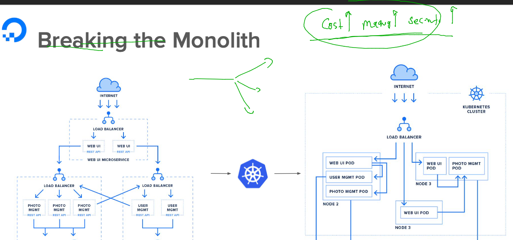
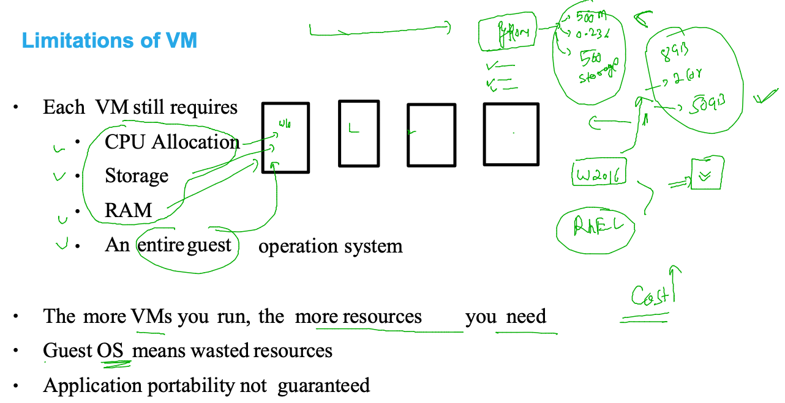
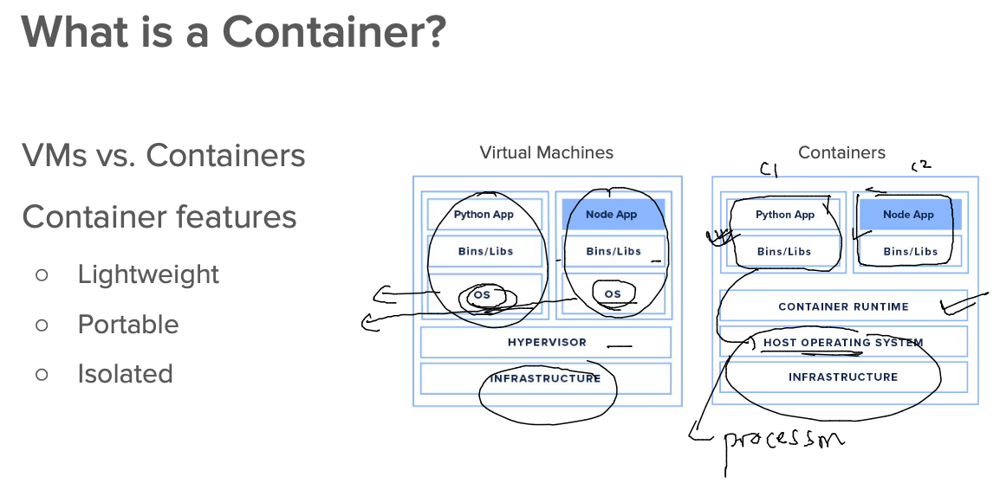
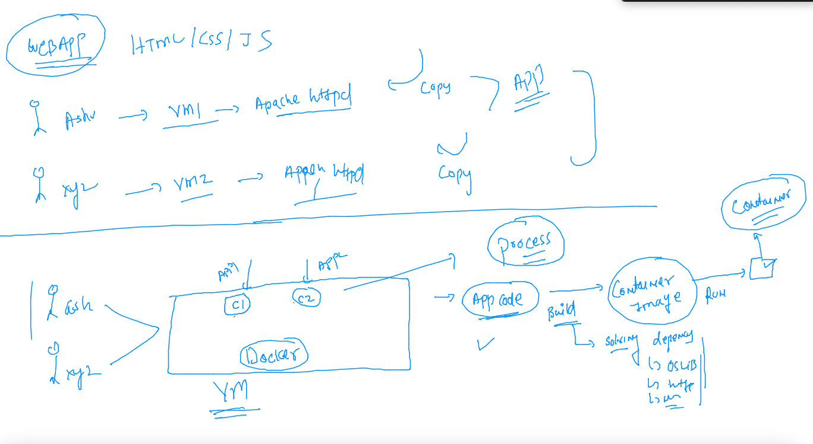
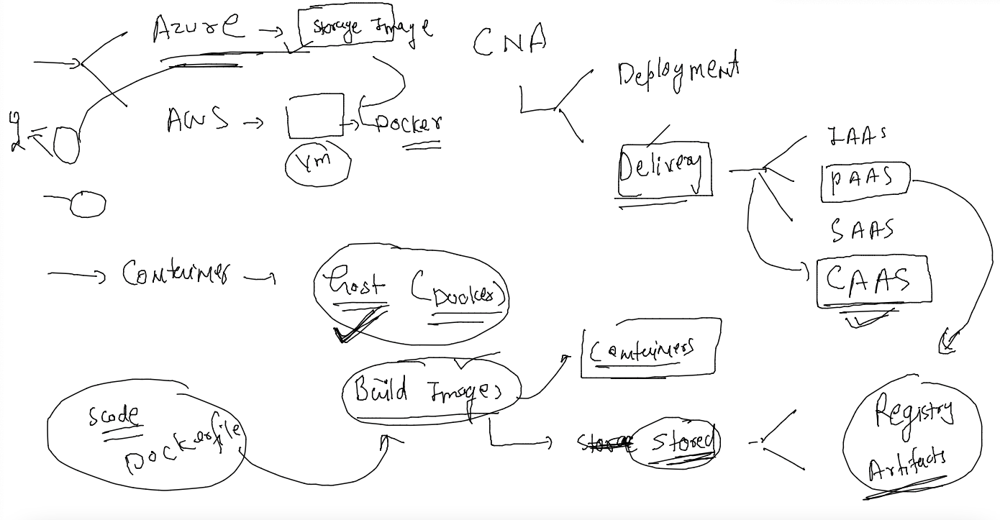
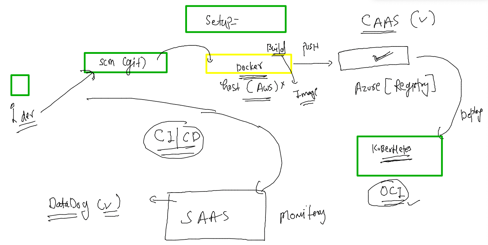

# CNA --

### training plan 


### monolith break 



### problems with vm 



### container with app 



### Installing docker on LInux vM 

```
[root@docker-server ~]# yum install  docker  -y 
Failed to set locale, defaulting to C
Loaded plugins: extras_suggestions, langpacks, priorities, update-motd
Resolving Dependencies
--> Running transaction check
---> Package docker.x86_64 0:20.10.13-2.amzn2 will be installed
--> Processing Dependency: runc >= 1.0.0 for package: docker-20.10.13-2.amzn2.x86_64
--> Processing Dependency: l
```

### creating users for docker access 

```
 36  for  i in  ashu arun eric inder ishrak john lucy naveen oliver rahul siva ujjwal ; do useradd $i; echo "Cisco@1234#"  |  passwd $i --stdin ; usermod -aG docker  $i; done 
   37  systemctl enable --now docker 
   

```

### lets connect to docker engine 

```
[ashu@docker-server ~]$ docker  version 
Client:
 Version:           20.10.13
 API version:       1.41
 Go version:        go1.16.15
 Git commit:        a224086
 Built:             Thu Mar 31 19:20:32 2022
 OS/Arch:           linux/amd64
 Context:           default
 Experimental:      true

Server:
 Engine:
  Version:          20.10.13
  API version:      1.41 (minimum version 1.12)
  Go version:       go1.16.15
  Git commit:       906f57f
  Built:            Thu Mar 31 19:21:13 2022
  OS/Arch:          linux/amd64
  Experimental:     false
 containerd:
  Version:          1.4.13
  GitCommit:        9cc61520f4cd876b86e77edfeb88fbcd536d1f9d
 runc:
  Version:          1.0.3
  GitCommit:        f46b6ba2c9314cfc8ca
```
### COntainer based application running 



### Frontend app 

```
[ashu@docker-server ~]$ mkdir  ashu_apps 
[ashu@docker-server ~]$ ls
ashu_apps
[ashu@docker-server ~]$ cd  ashu_apps/
[ashu@docker-server ashu_apps]$ git clone https://github.com/schoolofdevops/html-sample-app.git
Cloning into 'html-sample-app'...
remote: Enumerating objects: 74, done.
remote: Total 74 (delta 0), reused 0 (delta 0), pack-reused 74
Receiving objects: 100% (74/74), 1.38 MiB | 18.85 MiB/s, done.
Resolving deltas: 100% (5/5), done.
[ashu@docker-server ashu_apps]$ ls
html-sample-app
[ashu@docker-server ashu_apps]$ 
```

### adding dockerfile 

```
[ashu@docker-server ashu_apps]$ cat Dockerfile 
FROM fedora
# we are using fedora based os Libs from docker hub 
LABEL name=ashutoshh
RUN yum  install httpd -y 
COPY html-sample-app   /var/www/html/
# copy app to /var/www/html/ default root for apache httpd 
EXPOSE 80 
# let your docker engine know that default port is 80 for apache httpd (optional field)
ENTRYPOINT  httpd -DFOREGROUND 
```

### lets build 

```
[ashu@docker-server ashu_apps]$ ls
Dockerfile  html-sample-app
[ashu@docker-server ashu_apps]$ docker  build  -t   ashufrontend:appv1  .  
Sending build context to Docker daemon  3.629MB
Step 1/6 : FROM fedora
 ---> 98ffdbffd207
Step 2/6 : LABEL name=ashutoshh
 ---> Running in 04a97bebdc24
Removing intermediate container 04a97bebdc24
 ---> 747764a66b99
Step 3/6 : RUN yum  install httpd -y
 ---> Running in 7ab7b923cbd6
Fedora 36 - x86_64                               21 MB/s |  81 MB     00:03    


```

### checking build images 

```
[ashu@docker-server ashu_apps]$ docker  images
REPOSITORY       TAG       IMAGE ID       CREATED              SIZE
naveefrontend    appv1     8ee51a4424fc   11 seconds ago       448MB
john             appv1     a33af9856086   14 seconds ago       448MB
rahulfrontend    appv1     315753ea2dc5   14 seconds ago       448MB
ishrakfrontend   appv1     23d8a63b8da0   14 seconds ago       448MB
ashufrontend     appv1     b961929bc8cc   23 seconds ago       448MB
ezong            appv1.0   6413d3b4d1b2   49 seconds ago       448MB
```

### creating frontend container app 

```
[ashu@docker-server ashu_apps]$ docker  run  -d  --name ashufrc1   -p 1234:80    ashufrontend:appv1 
273ba744a7ccc82b336e3bda932c6e41264b23de92728bd61c7b751a8bfd359f
[ashu@docker-server ashu_apps]$ docker  ps
CONTAINER ID   IMAGE                COMMAND                  CREATED         STATUS         PORTS                                   NAMES
273ba744a7cc   ashufrontend:appv1   "/bin/sh -c 'httpd -…"   6 seconds ago   Up 4 seconds   0.0.0.0:1234->80/tcp, :::1234->80/tcp   ashufrc1
[ashu@docker-server ashu_apps]$ 


```

### CAAS 



### final cicd based implementaiton 



### commit code in your personal git repo 

```
git clone  https://github.com/redashu/demo-cisco-app.git
cp Dockerfile  demo-cisco-app/
rm -rf  html-sample-app/.git 
rm -rf  html-sample-app/README.txt
cp -rf  html-sample-app/*  demo-cisco-app/
cd  demo-cisco-app/
git  add  .
git config --global user.email ashutoshh@linux.com
git config --global user.name  redashu
git commit -m  "app v1 "


```
### now push the changes 


