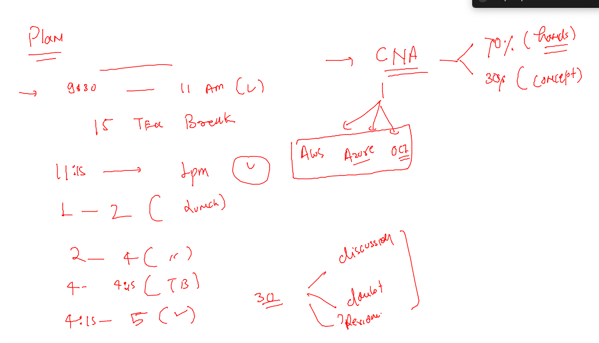
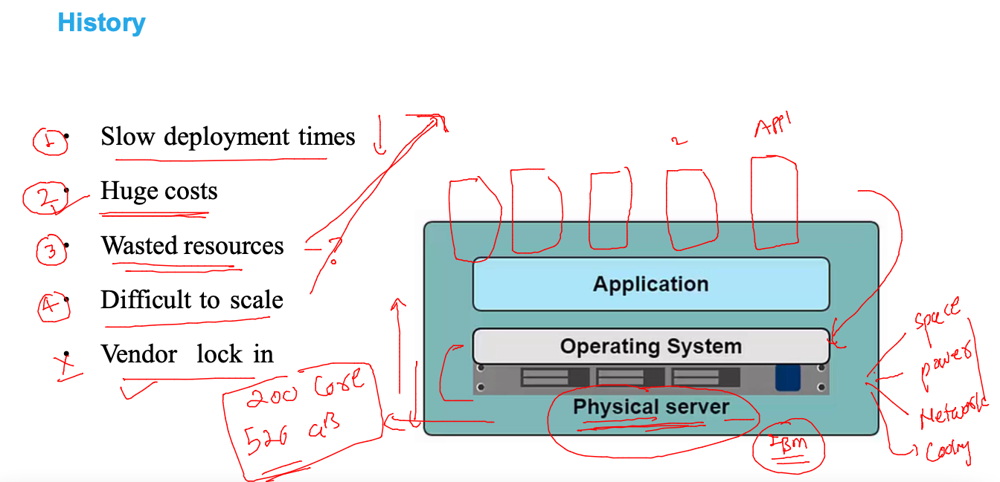
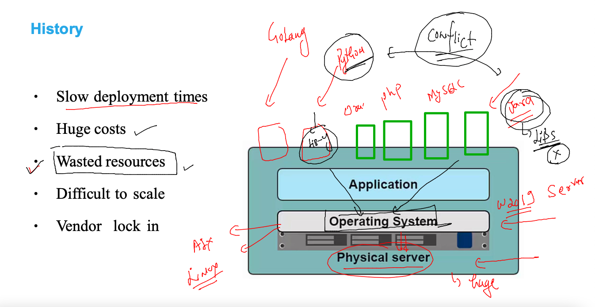
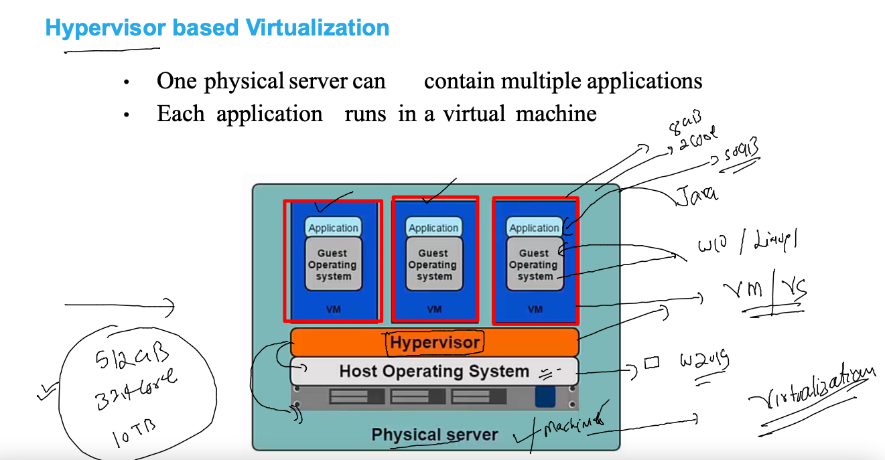
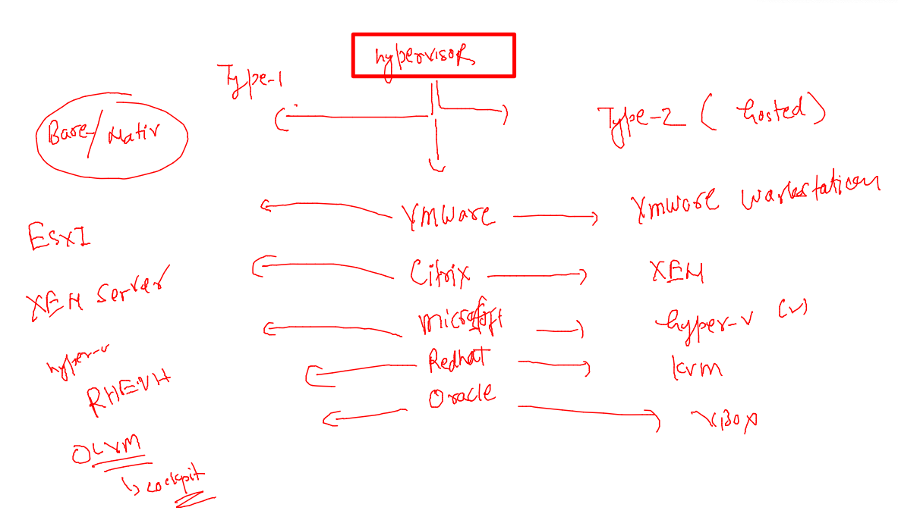
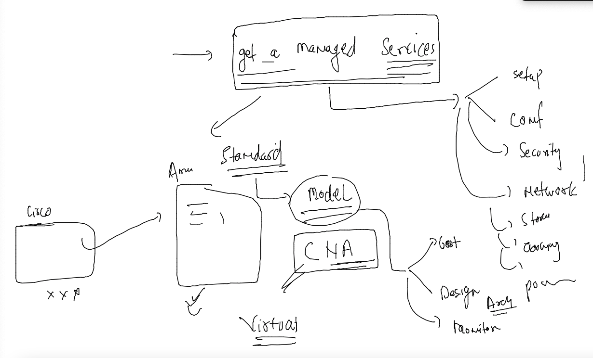
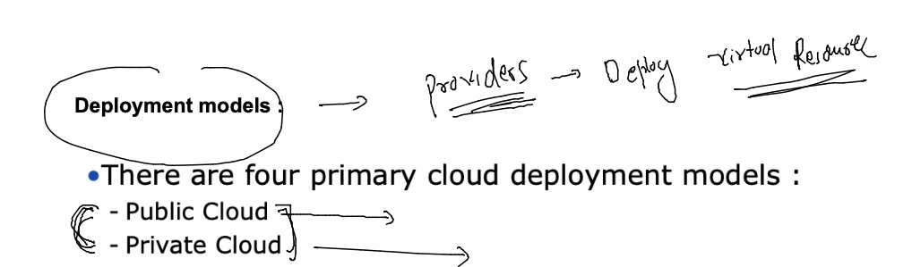
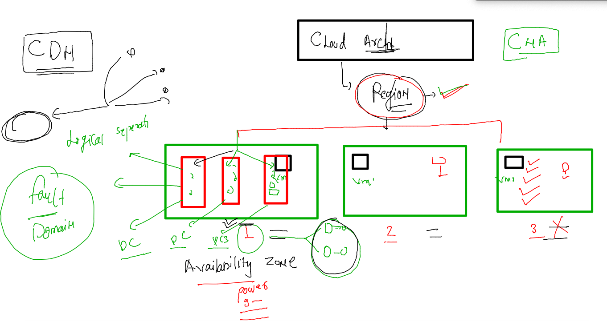
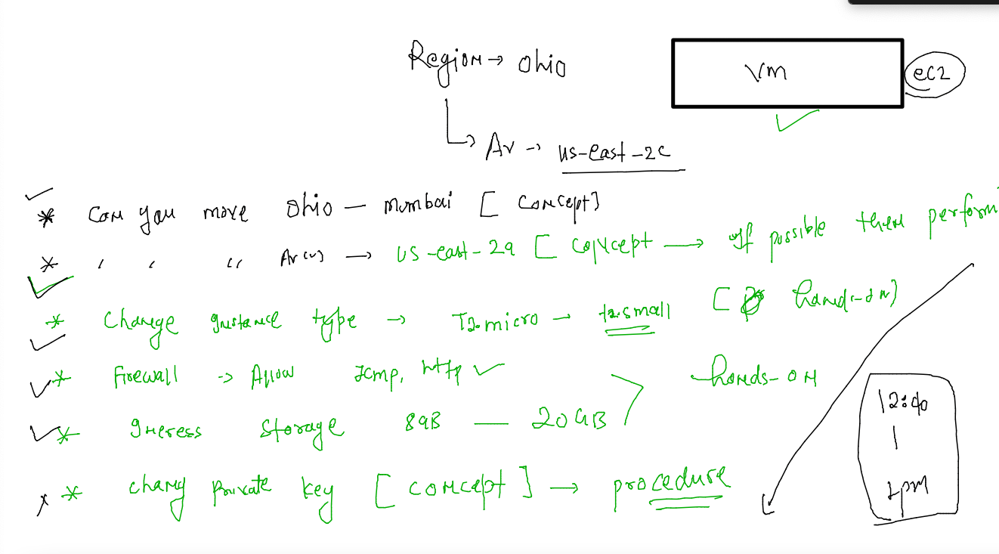
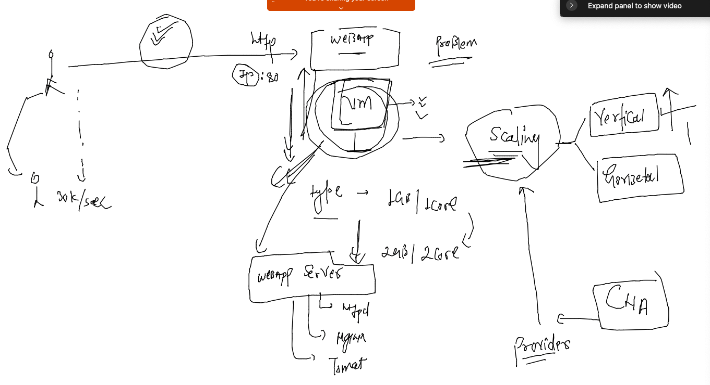

# CNA --

### training plan 



### problems in app testing / deployment in past 



### wastage of resources due to app libs confict with Host OS 



### Introduction to Virtulailiztion using Hypervisor 



### type 1 and type 2 Hypervisors 



### to avoid manaual management we can adopt / outsource resources -- managed by others 



## intro to Virtual / cloud computing services 

### Cloud Deployments Model -- for Providers 


 
### cloud delivery models 


### IAAS -- CNA model 



### launching instance in aws cloud using ec2 service and accessing it via ssh 

```
fire@ashutoshhs-MacBook-Air ~ % ls  -l Downloads/ashuciscokey.pem 
-rw-r--r--@ 1 fire  staff  1704 Jul 18 12:17 Downloads/ashuciscokey.pem
fire@ashutoshhs-MacBook-Air ~ % 
fire@ashutoshhs-MacBook-Air ~ % 
fire@ashutoshhs-MacBook-Air ~ % chmod 400 Downloads/ashuciscokey.pem   ## Don't required in Windows powershell 
fire@ashutoshhs-MacBook-Air ~ % 
fire@ashutoshhs-MacBook-Air ~ % 
fire@ashutoshhs-MacBook-Air ~ % ls  -l Downloads/ashuciscokey.pem    
-r--------@ 1 fire  staff  1704 Jul 18 12:17 Downloads/ashuciscokey.pem
fire@ashutoshhs-MacBook-Air ~ % 
fire@ashutoshhs-MacBook-Air ~ % ssh  -i Downloads/ashuciscokey.pem  ec2-user@18.218.165.169 
The authenticity of host '18.218.165.169 (18.218.165.169)' can't be established.
ECDSA key fingerprint is SHA256:bjN3EsKtxZY54ua/HUcVefqcTaJCeX99l6pnPUVZZIs.
Are you sure you want to continue connecting (yes/no/[fingerprint])? yes
Warning: Permanently added '18.218.165.169' (ECDSA) to the list of known hosts.

       __|  __|_  )
       _|  (     /   Amazon Linux 2 AMI
      ___|\___|___|

https://aws.amazon.com/amazon-linux-2/
5 package(s) needed for security, out of 14 available
Run "sudo yum update" to apply all updates.
-bash: warning: setlocale: LC_CTYPE: cannot change locale (UTF-8): No such file or directory
[ec2-user@ip-172-31-32-163 ~]$ 
```

### task 




### High traffic in app server and Vertical scaling 



### Install  apache httpd in ec2 instances 

```
fire@ashutoshhs-MacBook-Air ~ % ssh  -i Downloads/ashuciscokey.pem  ec2-user@3.144.138.192
Last login: Mon Jul 18 08:53:05 2022 from 103.59.75.87

       __|  __|_  )
       _|  (     /   Amazon Linux 2 AMI
      ___|\___|___|

https://aws.amazon.com/amazon-linux-2/
5 package(s) needed for security, out of 14 available
Run "sudo yum update" to apply all updates.
-bash: warning: setlocale: LC_CTYPE: cannot change locale (UTF-8): No such file or directory
[ec2-user@ip-172-31-32-163 ~]$ 
[ec2-user@ip-172-31-32-163 ~]$ 
[ec2-user@ip-172-31-32-163 ~]$ sudo -i
[root@ip-172-31-32-163 ~]# whoami
root
[root@ip-172-31-32-163 ~]# 
```

### install httpd 

```
 yum  install httpd git  -y 
```

### clone code from github 

```
git  clone https://github.com/redashu/ciscowebapp1.git
Cloning into 'ciscowebapp1'...
remote: Enumerating objects: 7, done.
remote: Counting objects: 100% (7/7), done.
remote: Compressing objects: 100% (5/5), done.
remote: Total 7 (delta 0), reused 0 (delta 0), pack-reused 0
Receiving objects: 100% (7/7), 115.54 KiB | 3.21 MiB/s, done.

[root@ip-172-31-32-163 ~]# ls
ciscowebapp1
[root@ip-172-31-32-163 ~]# cp  -rf  ciscowebapp1/*   /var/www/html/
[root@ip-172-31-32-163 ~]# cd /var/www/html/
[root@ip-172-31-32-163 html]# ls
README.md  cloud.png  index.html
[root@ip-172-31-32-163 html]# 
```

### start app server 

```
[root@ip-172-31-32-163 html]# systemctl enable --now httpd
Created symlink from /etc/systemd/system/multi-user.target.wants/httpd.service to /usr/lib/systemd/system/httpd.service.
[root@ip-172-31-32-163 html]# systemctl status  httpd
● httpd.service - The Apache HTTP Server
   Loaded: loaded (/usr/lib/systemd/system/httpd.service; enabled; vendor preset: disabled)
   Active: active (running) since Mon 2022-07-18 09:26:15 UTC; 8s ago
     Docs: man:httpd.service(8)
 Main PID: 3699 (httpd)
   Status: "Processing requests..."
   CGroup: /system.slice/httpd.service
           ├─3699 /usr/sbin/httpd -DFOREGROUND
           ├─3700 /usr/sbin/httpd -DFOREGROUND
           ├─3701 /u
```


